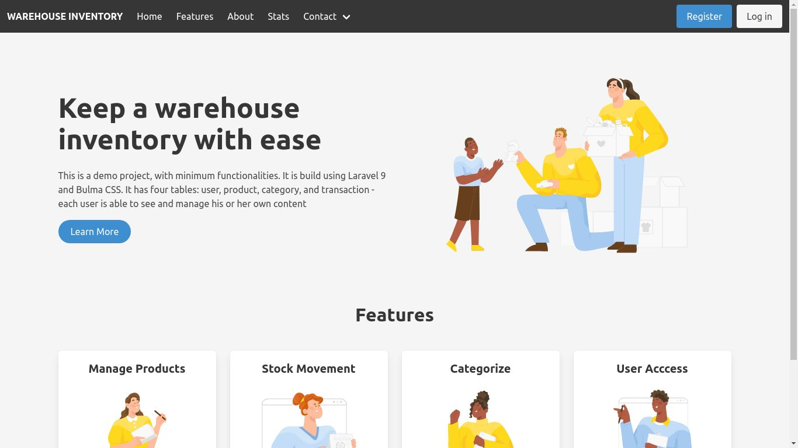

    

# Warehouse Inventory

A (minimal viable product) project for managing stock in a warehouse

### Requirements

-   Php 8
-   Git
-   Composer 2
-   Database: Sqlite, Mysql, Postgres

### Installation

-   `git clone https://github.com/6hislain/warehouse-inventory`
-   `cd warehouse-inventory`
-   `composer install`
-   rename and edit `.env.example` to `.env`
-   `php artisan key:generate`
-   `php artisan storage:link`
-   `php artisan migrate`
-   `php artisan serve`
